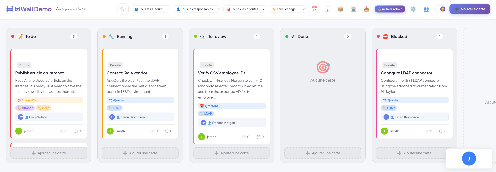
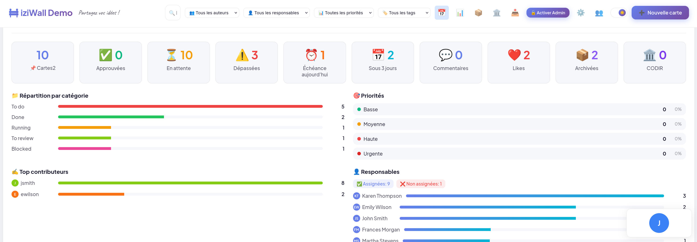
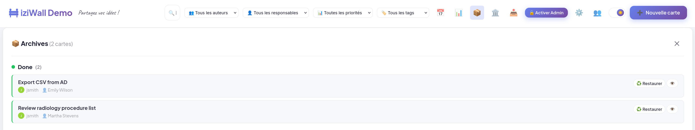
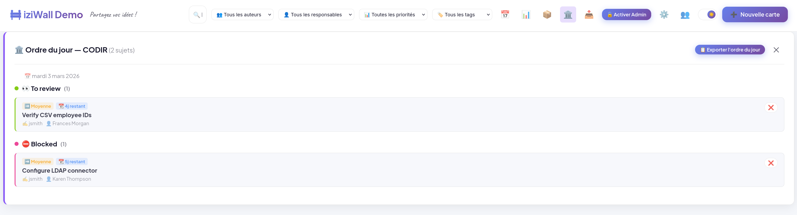
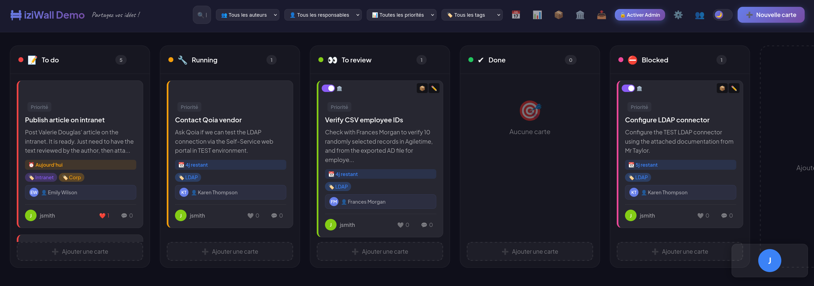
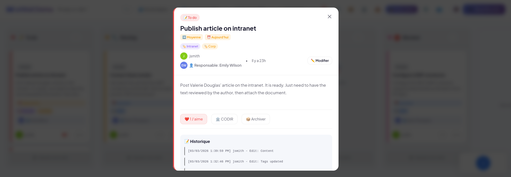

# 📌 Collaborative Wall - Enhanced Grist Widget

> **Available Languages** : [🇫🇷 Français](./README.md) | [🇺🇸 English](./README.en.md)

A custom Grist widget to create a **collaborative wall** with Kanban system, moderation, and real-time collaboration.

> 🎮 **Live Demo** : [Try iziWall](https://grist.numerique.gouv.fr/o/iziwall-demo/dVQtFTVwGDgH/iziWall-Demo)  
> When prompted for an email address, simply click the **👻 Anonymous** button to access the demo board.



## ✨ New Features
### 📊 Interactive Statistics (v2.7)
- **Click to filter** : Every element in the statistics panel is clickable and instantly filters the board
  - **Stat cards** : Total, Approved, Pending, Overdue, Due today, Due soon → apply corresponding filter
  - **Category bars** : Click to scroll to matching column
  - **Author / responsible bars** : Filter by author or responsible
  - **Priorities** : Filter by priority (Critical, High, Medium, Low)
  - **Tags** : Filter by tag
  - **Assigned / Unassigned badges** : Filter cards with or without responsible
  - **Archives & CODIR** : Open their respective panel directly
- **Reset filters button** in the statistics panel header
- **Active responsibles only** : Responsible stats exclude finished and archived cards
- **Visual effects** : Hover with translation, shadow and accent border on clickable elements
### � Card Sharing & Email (v2.6)
- **Copy a card** : 📋 button in the detail view to copy the full card content to clipboard (title, category, priority, deadline, author, responsible, tags, description, comments)
- **Send by email** : 📧 button in detail view opens a dedicated modal
  - **Recipient selection** :
    - Quick click on the card's responsible person (if email is known)
    - Dropdown list of responsible persons with email
    - Free-form email address input
  - **Custom message** : Add a personal message to the email body
  - **Preview** : See the content that will be sent before sending
  - **Mail client** : Opens the browser's email client (mailto:) with pre-filled subject and body
  - Compatible with Outlook, Thunderbird, Gmail, etc.
- **No server required** : Works entirely client-side

### �🔍 Advanced Search/Filtering
- **Real-time search bar** : Search cards by title, content or author
- **Filter by author** : See only cards from a specific person
- **Filter by responsible** : Display cards assigned to a specific person, or unassigned cards
- **Filter by priority** : Display only urgent, important cards, etc.
- **Filter by tag** : Select a tag from the dropdown to display matching cards
- **Combine filters** : Filters work together to refine your search

### 🎯 Drag & Drop Between Columns
- **Smooth movement** : Drag cards from one column to another
- **Visual feedback** : See the drop zone in real-time
- **Smooth animations** : Elegant transitions when moving
- **Instant updates** : Columns update immediately

### 🏷️ Custom Status Badges
- **Approval badge** : Cards pending approval are clearly marked (⏳)
- **Priority badges** : Each card displays its priority with a distinct color
  - ⬇️ **Low** (green) : Not urgent
  - ➡️ **Medium** (orange) : Normal
  - ⬆️ **High** (red) : Important
  - 🔴 **Urgent** (dark red) : Critical with pulsing animation

### 📅 Deadline Indicators
- **Smart deadline display** :
  - ⚠️ **Overdue** : Displayed in red
  - ⏰ **Today** : Displayed in orange
  - 📅 **Tomorrow** : Displayed in light blue
  - 📆 **Upcoming days** : Countdown visible
- **Deadlines appear on each card**
- **Smooth appearance animations**

### ✨ Enhanced Animations
- **Card hover** : Elevation and increased shadow
- **Drag & Drop** : Transparent cards and slight rotation
- **Badges** : Appearance with left-to-right slide
- **Deadlines** : Bottom-to-top slide appearance
- **Urgent Priority** : Continuous pulsing to grab attention
- **Theme transitions** : Smooth light ↔ dark switching

## 📊 New Features (v2.7)

### 📊 Interactive Statistics
- **All elements in the stats panel are clickable** : filter the board or open the corresponding panel
- **Reset filters button** added in the stats header
- **Active responsibles only** : excludes finished and archived cards
- **Visual hover effects** on all clickable elements

## 📊 New Features (v2.6)

### 📧 Card Sharing & Email
- **📋 Copy** : Copies the formatted card content to clipboard
- **📧 Send** : Recipient selection modal (responsible, list, or free-form) with preview and custom message
- Opens native mail client via `mailto:` — no server required

## 📊 New Features (v2.5)

### ⚠️ Overdue Cards Alert
- **Automatic popup** : On login (email or auto-login), if cards assigned to the user (author or responsible) have overdue deadlines, a modal alert is displayed
- **Detailed list** : Each overdue card shows its title, category, deadline date and days overdue
- **Quick access** : Clicking a card in the alert opens its detail directly
- **Calendar link** : "📅 View my calendar" button to switch to the calendar panel
- **Once per session** : The alert is shown only once per session

### 🚪 Logout
- **Logout button** : 🚪 icon in the header to disconnect and switch to anonymous mode
- **Login button** : 🔑 icon displayed in anonymous mode for quick login

## 📊 New Features (v2.4)

### 📅 Calendar: login required & robust matching
- **Anonymous mode** : Calendar panel now shows a login invitation screen (🔒) with a "Log in" button instead of an empty calendar
- **Case-insensitive matching** : Author/responsible detection now ignores case differences
- **Multi-identity** : Calendar matches on pseudo, first+last name, email, and name from the Responsables table for robust matching
- **"Terminé" detection fixed** : Strict name-based detection to avoid false positives

## 📊 New Features (v2.3)

### 📋 Card Duplication
- **Quick duplicate** : 📋 button on hover on each card (between Archive and Edit)
- **Same category** : The copy is created in the same column as the original
- **Automatic title** : " - Copy" suffix is added to the title
- **Traceability** : History logs the duplication with reference to the original card
- **Properties copied** : Content, priority, deadline, tags, responsible, images and links
- **CODIR and Archive reset** to false on the copy

## 📊 New Features (v2.2)

### 🖥️ Exclusive Panels
- **Auto-close** : Opening a panel (Statistics, Archives, CODIR, Calendar) automatically closes the others
- **Unified experience** : No need to manually close each panel

### 🏛️ Enhanced CODIR
- **Card content** : The CODIR panel and export now display card content (text preview)
- **Deadline shown** : The due date appears in the panel and in the export
- **Finished cards** : Cards in the last column no longer show overdue deadline labels (✅ Finished instead)

### 📅 Improved Calendar
- **Extended matching** for responsibilities: matching also works by full name (from the Responsables table), not just by alias

## 📊 New Features (v2.0+)

### 📈 Board Statistics



- **Interactive dashboard** : See at a glance:
  - 📌 Total cards
  - ✅ Approved cards
  - ⏳ Pending approval
  - ⚠️ Overdue cards (past deadline)
  - ⏰ Due today
  - 📅 Due within 3 days
  - 💬 Total comments
  - ❤️ Total likes
- **Distribution charts** :
  - Cards per category (colored horizontal bars)
  - Priority distribution with percentages
  - Top contributors (most active authors)
  - Responsible person distribution (assigned vs unassigned)
  - Top 8 most used tags (clickable)
  - Card content overview (images, links, attachments, distinct tags)
- **Toggle** : Show/hide dashboard with 📊 button in header

### 🏷️ Tags/Colors Management
- **Custom tags** : Add multiple tags to each card
  - Format: `urgent, client, feedback`
  - Separated by commas
- **Automatic colors** : Each tag has a distinct color
  - Colors determined automatically
  - Consistent across all cards
- **Filter by tag** : Click a tag to see all cards with that tag
- **Display** :
  - Tags visible on each card (🏷️ Label)
  - Clickable tags to filter instantly
  - Tags in detail view

### 📝 Enhanced History & Comments
- **Automatic history** :
  - Track every card modification
  - **State change tracking**: every column move is logged (e.g., `"To Do" → "In Progress"`)
  - Admin approval tracking
  - Shows who modified, what and when
  - Format: `[Date/Time] Author - Action: Details`
  - Visible in detail view (last 5 entries)
- **Rich comments** :
  - Add discussions on each card
  - Timestamp display
  - Ability to edit your own comments (next version)
  - Delete comments by author or admin
- **Traceability** :
  - Know who created, modified, moved, approved each card
  - Full history of state transitions (columns)
  - Complete change reference

### 📦 Archiving



- **Archive completed cards** :
  - 📦 button on hover on each card or in detail view
  - Archived cards disappear from the main board
  - Automatic history (date/author of archiving)
- **Unarchive** :
  - Archive panel accessible via the 📦 button in the header
  - ♻️ Restore button to put a card back on the board
  - Grouped display by category
- **Export** :
  - Archived cards are included in CSV export with the "Archived" column

### 🏛️ CODIR (Executive Committee)



- **Flag cards for CODIR** :
  - Toggle slider at the top-left of each card
  - Visible on hover, stays visible when active
  - 🏛️ icon on flagged cards
  - CODIR button also available in detail view
  - Automatic history of additions/removals
- **CODIR Agenda** :
  - Dedicated panel accessible via the 🏛️ button in header
  - Cards grouped by category and sorted by priority
  - Today's date displayed
  - Printable HTML export (formatted agenda)
  - Quick card removal from panel
- **Export** :
  - "CODIR" column in CSV export
  - CODIR counter in statistics

### � Personal Calendar
- **Overview of your tasks** :
  - 📅 Button in the header to see all your cards
  - Displays cards where you are **author** or **responsible**
  - Grouped by urgency: Overdue, Today, Tomorrow, This week, Next week, Later, No deadline
  - Quick summary badges (number overdue, due today)
- **Card details** :
  - Priority, category, deadline with visual indicator
  - Role displayed (author or responsible)
  - Click to open card detail view
  - CODIR flag visible

### �📤 Export & Share
- **CSV Export** :
  - 📥 Export button in header
  - Complete format: Title, Category, Author, Priority, Deadline, Tags, Status
  - Includes statistics: number of likes and comments
  - Compatible with Excel/Google Sheets
  - File named `collaborative-wall-YYYY-MM-DD.csv`
- **Share view** :
  - 🔗 Generates URL with current filters
  - Auto-copies to clipboard
  - Share filtered view (e.g. by author, priority, tags)
  - Recipients see the same view

## 📊 Existing Features

### 👥 User Management
- **Simplified 2-step login** :
  1. Enter email only
  2. If email exists → automatic login; otherwise → profile creation
- **Automatic Grist detection** : If user is logged into a Grist session (DINUM), their email is detected automatically
- **Anonymous mode** : Option to continue without an account (👻)
- **Persistent session** : Email saved locally for future visits
- **Smart permissions** :
  - Moderators can approve/reject
  - Normal users can modify their own cards
  - Admin mode for full management

### 👤 Responsibility Assignment


- **Assign a responsible** : Each card can have a responsible person
- **Manage responsibles** (👥 in header) :
  - Add new responsible persons (name, email, role)
  - Edit existing responsible persons
  - Delete responsible persons (with automatic card update)
  - Name change propagation: renaming updates all assigned cards
- **Dedicated table** : Grist `Responsables` table (with fallback to Users)
- **Responsible display** :
  - Avatar with initials (primary color)
  - Name displayed as badge 👤
  - Role shown in selector
  - Visible on cards and in detail view
- **History** : Changes to responsible are logged
- **Export** : Responsible included in CSV export

### 🎨 Light/Dark Theme



- **Theme toggle** : Switch between light and dark mode
- **Persistence** : Your preference is saved
- **Responsive design** : Works perfectly on all devices

### 📁 Category Management


- **Custom columns** : Create as many columns as needed
- **Customization** :
  - Custom emoji
  - Distinct color
  - Configurable name
- **Drag & drop order** : Reorganize columns (future)

### ✔️ Moderation System



- **Activable moderation mode** : Admin can enable/disable moderation
- **Approval required** : New cards are pending approval
- **Smart visibility** :
  - Admins see everything
  - Users see approved cards + their own cards
- **Quick action buttons** : Fast control for moderators

### 💬 Social Interactions
- **Likes/Votes** : ❤️ Users can mark favorite cards
- **Comments** : Discuss directly on each card
- **Counters** : Display likes and comments on each card
- **Animations** : ❤️ Heartbeat animation on like

### 📎 Attachments & Links
- **View attachments** : Images and attached files can be viewed and downloaded directly from the widget
- **Add attachments** : Files must be added directly in the `PieceJointe` column of the `Cartes` table in the Grist interface (iframe widget CORS limitation)
- **External links** : Add URLs to resources from the widget
- **Previews** : Distinct icons by file type

### 🔄 Supported Fields

| Field | Type | Description |
|-------|------|-------------|
| **Title** | Text | Main card title |
| **Content** | Long Text / Rich Text | Detailed description |
| **Author** | Text | Author name |
| **Author_Pseudo** | Text | User nickname |
| **Session_ID** | Text | Unique session ID |
| **Category** | Link | Link to category |
| **Approved** | Boolean | Approval status |
| **CreatedDate** | Date | Creation date |
| **Priority** | Select | low / medium / high / urgent |
| **Deadline** | Date | Due date |
| **ImageURL** | Text | Image URL |
| **ExternalLink** | Text | External URL |
| **Attachment** | Attachments | Attached files |
| **Tags** | Text | Comma-separated tags |
| **Responsible** | Text | Responsible person's nickname |
| **Archive** | Boolean | Archived card (true/false) |
| **History** | LongText | Modification history |
| **Order** | Number | Display order |

## 🚀 Installation & Configuration

### 1. Required Grist Structure

```
📊 Grist Document
├── Categories (table)
│   ├── id
│   ├── Name
│   ├── Color (text hex)
│   ├── Icon (emoji)
│   └── Order
├── Cards (table)
│   ├── id
│   ├── Title
│   ├── Content
│   ├── Author
│   ├── Author_Pseudo
│   ├── Session_ID
│   ├── Category (Link to Categories)
│   ├── Approved (checkbox)
│   ├── CreatedDate
│   ├── Priority (select: low, medium, high, urgent)
│   ├── Deadline (date)
│   ├── ImageURL
│   ├── ExternalLink
│   ├── Attachment (attachments)
│   ├── Tags (text)
│   ├── Responsible (text)
│   ├── Archive (boolean)
│   ├── Codir (boolean)
│   ├── History (LongText)
│   └── Order
├── Likes (table)
│   ├── id
│   ├── Card (Link to Cards)
│   ├── Pseudo
│   └── DateLike
├── Comments (table)
│   ├── id
│   ├── Card (Link to Cards)
│   ├── Pseudo
│   ├── Content
│   └── DateComment
└── Configuration (table)
    ├── id
    ├── Key
    ├── Value
    └── Value_Text
├── Responsables (table, optional)
│   ├── id
│   ├── Nom (text)
│   ├── Email (text)
│   └── Fonction (text)
```

### 2. Deploy the Widget

1. Copy the files:
   - `index.html`
   - `index.js`

2. In Grist, create a **Custom Widget**:
   - Go to your table
   - Insert a custom widget
   - Point to `index.html`

### 3. Initial Configuration

In the **Configuration** table, add these rows (optional):

```
Key                    | Value_Text
wall_emoji             | 📌
wall_title             | Collaborative Wall
wall_slogan            | Share your ideas!
moderation_active      | false (or true)
```

## 🎮 User Guide

### For Regular Users

1. **Add a card**:
   - Click "➕ New card"
   - Fill in title, content, priority, deadline
   - Click "Publish"

2. **Edit a card**:
   - Click on the card
   - Click "✏️ Edit"
   - Update the fields
   - Click "Save"

3. **Move a card**:
   - Drag and drop between columns
   - OR click the quick move arrows ← →
   - Card moves instantly

4. **Interact**:
   - ❤️ Like a card
   - 💬 Add a comment

5. **Filter**:
   - Use the **search bar** to search by title/content/author
   - Use the **dropdowns** to filter by author, responsible person, priority or tag

### For Administrators

1. **Enable/Disable moderation**:
   - Click "🔓 Activate Admin"
   - Click "🔒 Moderation ON/OFF"
   - New moderation takes effect immediately

2. **Approve cards**:
   - Pending cards display "⏳ Pending"
   - Click "✓ Approve" to validate
   - Click "✕ Reject" to delete

3. **Manage categories**:
   - Click "⚙️" (gear icon)
   - Add, edit or delete categories
   - Choose emoji and color

## 🎨 Customization

### Change Badge Colors

Edit in `index.js` the `PRIORITY_LEVELS` constant:

```javascript
const PRIORITY_LEVELS = {
  'low': { icon: '⬇️', color: '#10b981', label: 'Low' },
  'medium': { icon: '➡️', color: '#f59e0b', label: 'Medium' },
  'high': { icon: '⬆️', color: '#ef4444', label: 'High' },
  'urgent': { icon: '🔴', color: '#dc2626', label: 'Urgent' }
};
```

### Customize Animations

Animations are defined in `index.html` CSS section:
- `badgeSlideIn`: Badge animation
- `slideUp`: Deadline animation
- `urgentePulse`: Urgent priority pulsing
- `cardAppear`: Card appearance

## 🔒 Security & Permissions

- **Grist API Full**: Widget automatically generates session ID
- **Client-side validation**: Inputs are HTML-escaped
- **Server-side filtering**: Grist validates all modifications
- **Permission respect**: Users can only modify their own cards

## 🌍 Multi-Language Support

The widget is currently in **French and English**. To switch to another language, modify:
- Internal labels
- Toast messages
- Form placeholders

## 📝 Technical Notes

### Performance
- **Optimized loading**: Data loaded once at startup
- **Image caching**: Images cached locally
- **Smart refresh**: Doesn't disturb open modals
- **Efficient drag & drop**: Uses native events

### Compatibility
- ✅ Chrome/Chromium
- ✅ Firefox
- ✅ Safari
- ✅ Edge
- ✅ Mobile (responsive)

## 🐛 Troubleshooting

**Cards don't appear?**
- Check that the "Cards" table exists
- Verify the "Category" link is correct
- Verify you have categories

**Moderation doesn't work?**
- First enable admin mode
- Then enable moderation
- Reload the page

**Images don't display?**
- Check that "ImageURL" field is filled
- Or add an image attachment to "Attachment" field

## 📞 Support

For any questions or bug reports, check Grist documentation:
https://docs.getgrist.com/

---

## 🎬 Inspiration

This widget is inspired by the **collaborative wall** concept presented in this educational video:
👉 [Discover Grist Collaborative Wall](https://podeduc.apps.education.fr/video/132080-grist-mur-collaboratif/)

---

## 👨‍💻 Credits

**Built by [Bertrand Kuzbinski](https://github.com/MrKuBe) with Claude**

**Last Updated** : March 2026  
**Version** : 2.6.20260305 (Card sharing & email + Copy to clipboard)
